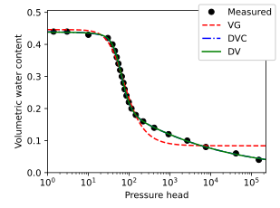
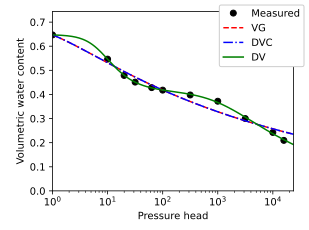
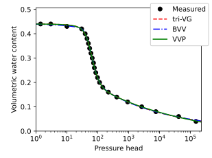

# Sample code for optimizing water retention curves

Easiest way to start learning how to use unsatfit is to run sample codes as instructed in this page. You can optimize parameters of WRF (water retention function)of [various available models](model.md) to measured data set. You can test with sample data provided in this page. [SWRC Fit](https://seki.webmasters.gr.jp/swrc/) can also be used. For optimizing HCF (hydraulic conductivity function) also, please refer to [this page](code-hcc.md).

- [Install Python 3 and unsatfit](install.md). Install [pandas](https://pypi.org/project/pandas/) by `python -m pip install pandas`.
- Prepare datafile as csv (comma-separated values) format for (h, &theta;) data in the filename “swrc.csv” with a header of “h, theta”. See [sample data of Gilat loam](https://raw.githubusercontent.com/sekika/unsatfit/refs/heads/main/docs/sample/gilat/swrc.csv).
- Download a sample code for the model that you select from below.
- Run the sample code at the same directory with the data file (swrc.csv). For running the code on Mac or unix-like system, edit the first line ([shebang](https://en.wikipedia.org/wiki/Shebang_(Unix))) and mark the file executable by <code>chmod +x VG.py</code>. For running on Windows, please refer to [Python on Windows FAQ](https://docs.python.org/3/faq/windows.html).
- Fitted parameters are shown at the standard output, where qs and qr means &theta;s and &theta;r respectively. Statistics are also shown.
- Note that the program is unit independent, meaning that the unit of the parameters depends on the unit of the input data. Unit of pressure head is assumed as cm for a (cm-1) and hb.
- Figure files are produced as svg files. For use in papers, pdf files can be produced as instructed in the sample code. To change the appearance of a figure, edit the figure settings in the sample code. For more figure options, see the [source code of unsatfit](https://github.com/sekika/unsatfit/blob/main/unsatfit/_init_fig.py).
- See [Reading data from Excel](excel.md) if you wish.

## List of sample codes
- [Brooks and Corey (BC) model](https://github.com/sekika/unsatfit/blob/main/docs/sample-wrc/BC.py)
- [van Genuchten (VG) model](https://github.com/sekika/unsatfit/blob/main/docs/sample-wrc/VG.py)
- [Kosugi (KO) model](https://github.com/sekika/unsatfit/blob/main/docs/sample-wrc/KO.py)
- [Fredlund und Xing (FX) model](https://github.com/sekika/unsatfit/blob/main/docs/sample-wrc/FX.py)
- [dual-BC (DB) model](https://github.com/sekika/unsatfit/blob/main/docs/sample-wrc/DB.py)
- [dual-BC-CH (DBC) model](https://github.com/sekika/unsatfit/blob/main/docs/sample-wrc/DBC.py)
- [dual-VG (DV) model](https://github.com/sekika/unsatfit/blob/main/docs/sample-wrc/DV.py)
- [dual-VG-CH (DVC) model](https://github.com/sekika/unsatfit/blob/main/docs/sample-wrc/DVC.py)
- [dual-KO (DK) model](https://github.com/sekika/unsatfit/blob/main/docs/sample-wrc/DK.py)
- [dual-KO-CH (DKC) model](https://github.com/sekika/unsatfit/blob/main/docs/sample-wrc/DKC.py)
- [VG1BC2 (VB) model](https://github.com/sekika/unsatfit/blob/main/docs/sample-wrc/VB.py)
- [VG1BC2-CH (VBC) model](https://github.com/sekika/unsatfit/blob/main/docs/sample-wrc/VBC.py)
- [KO1BC2 (KB) model](https://github.com/sekika/unsatfit/blob/main/docs/sample-wrc/KB.py)
- [KO1BC2-CH (KBC) model](https://github.com/sekika/unsatfit/blob/main/docs/sample-wrc/KBC.py)
- [Peters (PE) model](https://github.com/sekika/unsatfit/blob/main/docs/sample-wrc/PE.py)
- [Fayer and Simmons (VGFS) model](https://github.com/sekika/unsatfit/blob/main/docs/sample-wrc/VGFS.py)

## Multiple curves
- Use [sample code for multiple curves](https://github.com/sekika/unsatfit/blob/main/docs/sample-wrc/multi.py).
- It draws VG, dual-VG-CH (DVC) and dual-VG (DV) models in the same figure.
- It also shows the model with the smallest corrected AIC.
- Results with [sample data of Gilat loam](https://raw.githubusercontent.com/sekika/unsatfit/refs/heads/main/docs/sample/gilat/swrc.csv) and [Daisen Andisol](https://raw.githubusercontent.com/sekika/unsatfit/refs/heads/main/docs/sample-wrc/andisol/swrc.csv) (Fig. 9 in [this paper](https://www.jstage.jst.go.jp/article/jssoilphysics/155/0/155_35/_pdf/-char/en)) are shown below.

## UNSODA data
Here are sample codes to draw multiple fitting curves for the [UNSODA](https://agdatacommons.nal.usda.gov/articles/dataset/UNSODA_2_0_Unsaturated_Soil_Hydraulic_Database_Database_and_program_for_indirect_methods_of_estimating_unsaturated_hydraulic_properties/24851832) database and figures which were produced with the code. [pdfgridcat](https://pypi.org/project/pdfgridcat/) was used for arranging the figures.

- VG series: [VG, dual-VG-CH (DVC) and dual-VG (DV) models](https://github.com/sekika/unsatfit/blob/main/docs/sample-wrc/unsoda-vgs.py) and [figures](sample-wrc/pdf/unsoda-vgs.pdf).
- KO series: [KO, KO1BC2-CH (KBC) and dual-KO (DK) models](https://github.com/sekika/unsatfit/blob/main/docs/sample-wrc/unsoda-kos.py) and [figures](sample-wrc/pdf/unsoda-kos.pdf).
- CH series: [dual-BC-CH (DBC), VG1BC2-CH (VBC) and  KO1BC2-CH (KBC) models](https://github.com/sekika/unsatfit/blob/main/docs/sample-wrc/unsoda-ch.py) and [figures](sample-wrc/pdf/unsoda-ch.pdf).
- dual series: [dual-BC, dual-VG and dual-KO models](https://github.com/sekika/unsatfit/blob/main/docs/sample-wrc/unsoda-dual.py) and [figures](sample-wrc/pdf/unsoda-dual.pdf).

Method

- The code reads laboratory drying curves of UNSODA data from a [JSON converted file](https://sekika.github.io/file/unsoda/).
- &theta;r is fitted for VG and KO models, and &theta;r = 0 for other models.
- Upper limits are imposed for θs / max(θ) = 1.5 and n1, n2 = 8, along with a lower limit of σ2 = 0.2.
- The generated PDF files are concatenated using [this script](https://gist.github.com/sekika/1e8811868cebeca6c3443c69849929db).
- With the [UNSODA viewer](https://sekika.github.io/unsoda/), you can select a specific soil sample and send data directly to SWRC Fit by clicking the link labeled "Fit with various water retention models".

## Trimodal models
While trimodal water-retention functions provide the flexibility needed for media with
clear triple porosity, they also introduce additional degrees of freedom and may lead to non-unique parameterizations when data coverage is limited or noisy. Please use these sample code with cautions. See Seki et al. ([2026](https://researchmap.jp/sekik/published_papers/51967432/attachment_file.pdf)) for detail.

Here are sample codes for trimodal models.

- [tri-VG model](https://github.com/sekika/unsatfit/blob/main/docs/sample-wrc/tri-VG.py)
- [BC1VG2VG3 (BVV) model](https://github.com/sekika/unsatfit/blob/main/docs/sample-wrc/BVV.py)
- [VVP model](https://github.com/sekika/unsatfit/blob/main/docs/sample-wrc/VVP.py)
- [All these trimodal models](https://github.com/sekika/unsatfit/blob/main/docs/sample-wrc/trimodal.py)

By running the last code with [sample data of IL sandstone](https://raw.githubusercontent.com/sekika/unsatfit/refs/heads/main/docs/sample/IL/swrc.csv), this figure can be obtained.

