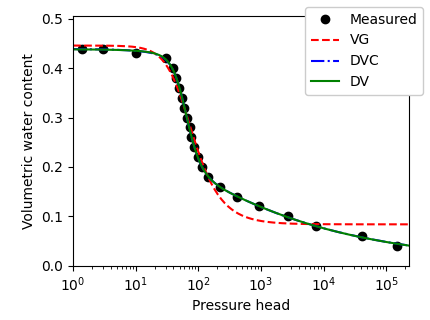
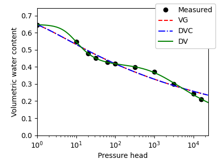

# Sample code for optimizing water retention curves

Easiest way to start learning how to use unsatfit is to run sample codes as instructed in this page. You can optimize parameters of WRF (water retention function)of [various available models](model.md) to measured data set. You can test with sample data provided in this page. [SWRC Fit](https://seki.webmasters.gr.jp/swrc/) can also be used. For optimizing HCF (hydraulic conductivity function) also, please refer to [this page](code-hcc.md).

- [Install Python 3 and unsatfit](install.md). Install [pandas](https://pypi.org/project/pandas/) by `python -m pip install pandas`.
- Prepare datafile as csv (comma-separated values) format for (h, &theta;) data in the filename “swrc.csv” with a header of “h, theta”. See [sample data of Gilat loam](https://raw.githubusercontent.com/sekika/unsatfit/refs/heads/main/docs/sample/gilat/swrc.csv).
- Download a sample code for the model that you select from below.
- Run the sample code at the same directory with the data file (swrc.csv). For running the code on Mac or unix-like system, edit the first line ([shebang](https://en.wikipedia.org/wiki/Shebang_(Unix))) and mark the file executable by <code>chmod +x VG.py</code>. For running on Windows, please refer to [Python on Windows FAQ](https://docs.python.org/3/faq/windows.html).
- Fitted parameters are shown at the standard output, where qs and qr means &theta;s and &theta;r respectively. Statistics are also shown.
- Note that the program is unit independent, meaning that the unit of the parameters depends on the unit of the input data. Unit of pressure head is assumed as cm for a (cm-1) and hb.
- Figure files are produced as png files. For use in papers, pdf files can be produced as instructed in the sample code. To change the appearance of a figure, edit the figure settings in the sample code. For more figure options, see the [source code of unsatfit](https://github.com/sekika/unsatfit/blob/main/unsatfit/_init_fig.py).

## List of sample codes
- [Brooks and Corey (BC) model](https://github.com/sekika/unsatfit/blob/main/docs/sample-wrc/BC.py)
- [van Genuchten (VG) model](https://github.com/sekika/unsatfit/blob/main/docs/sample-wrc/VG.py)
- [Kosugi (KO) model](https://github.com/sekika/unsatfit/blob/main/docs/sample-wrc/KO.py)
- [Fredlund und Xing (FX) model](https://github.com/sekika/unsatfit/blob/main/docs/sample-wrc/FX.py)
- [dual-VG (DV) model](https://github.com/sekika/unsatfit/blob/main/docs/sample-wrc/DV.py)
- [dual-VG-CH (DVC) model](https://github.com/sekika/unsatfit/blob/main/docs/sample-wrc/DVC.py)
- [VG1BC2-CH (VBC) model](https://github.com/sekika/unsatfit/blob/main/docs/sample-wrc/VBC.py)
- [KO1BC2-CH (KBC) model](https://github.com/sekika/unsatfit/blob/main/docs/sample-wrc/KBC.py)

## Multiple curves
- Use [sample code for multiple curves](https://github.com/sekika/unsatfit/blob/main/docs/sample-wrc/multi.py).
- It draws VG, and DVC and DV in the same figure.
- It also shows the model with the smallest corrected AIC.
- Results with [sample data of Gilat loam](https://raw.githubusercontent.com/sekika/unsatfit/refs/heads/main/docs/sample/gilat/swrc.csv) and [Daisen Andisol](https://raw.githubusercontent.com/sekika/unsatfit/refs/heads/main/docs/sample-wrc/andisol/swrc.csv) (Fig. 9 in [this paper](https://www.jstage.jst.go.jp/article/jssoilphysics/155/0/155_35/_pdf/-char/en)) are shown below.

## UNSODA data
- Use [sample code for multiple curves with UNSODA data](https://github.com/sekika/unsatfit/blob/main/docs/sample-wrc/unsoda.py).
- It uses [UNSODA data](https://sekika.github.io/file/unsoda/)
- The produced PDF files are [concatenated](https://gist.github.com/sekika/1e8811868cebeca6c3443c69849929db) and shown [here](sample-wrc/unsoda.pdf).
