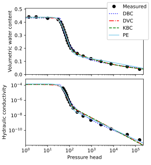

# Sample code of unsatfit

Easiest way to start learning how to use unsatfit is to run sample codes as instructed in this page. You can optimize parameters of WRF (water retention function) and HCF (hydraulic conductivity function) of [various available models](model.md) to measured data set.

- [Sample codes for optimizing **WRF only**](code-wrc.md)

- [Sample codes for optimizing **WRF and HCF**](code-hcc.md)

Use [pdfgridcat](https://pypi.org/project/pdfgridcat/) for arranging multiple figures.
