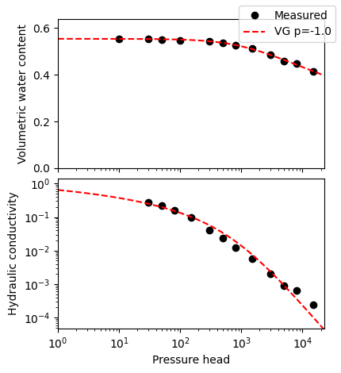
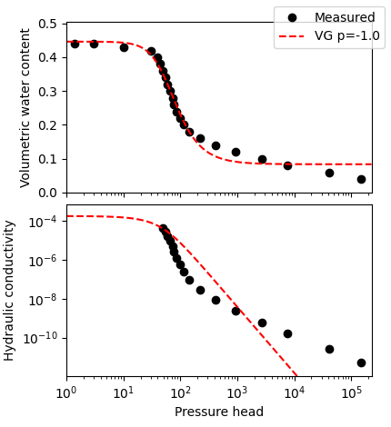
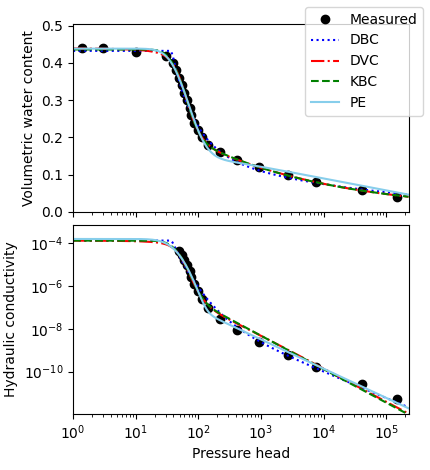

# Sample code of unsatfit

Easiest way to start learning how to use unsatfit is to run sample codes as instructed in this page. You can optimize parameters of WRF (water retention function) and HCF (hydraulic conductivity function) of [various available models](model.md) to measured data set. You can test with sample data provided. If you study Python and read the sample code, you will be able to use unsatfit flexibly according to your demand. For optimizing only WRF parameters, please use [SWRC Fit](swrcfit.md).

## <strong>VGM</strong> (van Genuchten - Mualem) model
- [Install Python 3 and unsatfit](install.md). Install [pandas](https://pypi.org/project/pandas/) by `python -m pip install pandas`.
- Prepare datafile as csv (comma-separated values) format for (h, &theta;) data in the filename “swrc.csv” with a header of “h, theta”. See [sample data of clay (Unsoda 2362)](https://raw.githubusercontent.com/sekika/unsatfit/main/docs/sample/clay2362/swrc.csv).
- Prepare (h, K) data in the filename “hcc.csv” with a header of “h, K”. See [sample (h, K) data of clay (Unsoda 2362)](https://raw.githubusercontent.com/sekika/unsatfit/main/docs/sample/clay2362/hcc.csv).
- Download a [sample code for VGM model](https://github.com/sekika/unsatfit/blob/main/docs/sample/VGM.py).
- Read the sample code and edit initial parameters, bound of parameters and figure setting as written in the comment of the sample code if necessary. For more figure options, see  __init_fig() function in the [source code of unsatfit](https://github.com/sekika/unsatfit/blob/main/unsatfit/unsatfit.py).
- Run the sample code at the same directory with data files (swrc.csv and hcc.csv). For running the code on Mac or unix-like system, edit the first line ([shebang](https://en.wikipedia.org/wiki/Shebang_(Unix))) and mark the file executable by <code>chmod +x VGM.py</code>. For running on Windows, please refer to [Python on Windows FAQ](https://docs.python.org/3/faq/windows.html).
- It first optimizes WRF parameters (&theta;s, &theta;r, a, n) of VG model, and then optimizes HCF parameters (Ks, p) of VG Mualem model, or modified VG model (hb=2) [Vogel et al. (2000)](https://doi.org/10.1016/S0309-1708(00)00037-3) when n &gt; 1.1.
- Fitted parameters are shown at the standard output, where qs and qr means &theta;s and &theta;r respectively, and R2 q means R2 for &theta; of water retention curve and R2 logK means R2 for log(K) of hydraulic conductivity curve. Note that the program is unit independent, meaning that the unit of the parameters depends on the unit of the input data. Unit of pressure head is assumed as cm for a (cm-1) and hb.
- Figure file is produced as VG.png. For use in papers, pdf file can be produced as instructed in the sample code.

Result with [sample data of clay (Unsoda 2362)](https://github.com/sekika/unsatfit/tree/main/docs/sample/clay2362) is shown below.

Result with [sample data of Gilat loam](https://github.com/sekika/unsatfit/tree/main/docs/sample/gilat) is shown below. In this case, bimodal model is appropriate, as shown below.

## Bimodal model with general HCF

[Bimodal model](https://seki.webmasters.gr.jp/swrc/model.html) with [general HCF](hcmodel.md) (Seki et al., [2022](https://doi.org/10.1002/vzj2.20168)) can represent water retention and hydraulic  conductivity of various types of soil in a wide range of pressure head, as verified in our paper which is in review process. You can conduct the same fitting as written in the paper by using the following sample codes.

## <strong>KBC</strong> (<strong>KO1BC2-CH</strong>) model (&theta;r=0, r=1)
- Use [sample code for KBC model](https://github.com/sekika/unsatfit/blob/main/docs/sample/KBC.py). See instruction in the VGM model above.
- It first optimizes WRF parameters (&theta;s, w, H, &sigma;1, &lambda;2) of KBC model (&theta;r=0), and then optimizes general HCF parameters (Ks, p, q) of KBC model (r=1), or modified KBC model (hb=2, r=1) when &sigma;1 &gt; 2.
- Result with [sample data of Gilat loam](https://github.com/sekika/unsatfit/tree/main/docs/sample/gilat) is shown below.

## <strong>DVC</strong> (<strong>dual-VG-CH</strong>) model (&theta;r=0, q=1)
- Use [sample code for DVC model](https://github.com/sekika/unsatfit/blob/main/docs/sample/DVC.py). See instruction in the VGM model above.
- It optimizes WRF parameters (&theta;s, w, a, n1, n2)  , and then optimizes general HCF parameters (Ks, p, r) of DVC model or modified DVC model (hb=2) when n1 or n2 is smaller than 1.1.
- Result with [sample data of Gilat loam](https://github.com/sekika/unsatfit/tree/main/docs/sample/gilat) is shown below.

## <strong>DBC</strong> (<strong>dual-BC-CH</strong>) model (&theta;r=0, r=1)
- Use [sample code for DBC model](https://github.com/sekika/unsatfit/blob/main/docs/sample/DBC.py). See instruction in the VGM model above.
- It optimizes WRF parameters (&theta;s, w, &lambda;1, &lambda;2), and then optimizes general HCF parameters (Ks, p, q) of DBC model.
- Result with [sample data of Gilat loam](https://github.com/sekika/unsatfit/tree/main/docs/sample/gilat) is shown below.

## <strong>Peters</strong> model (&theta;r=0, h0=6.3&times;106)
- Use [sample code for Peters model](https://github.com/sekika/unsatfit/blob/main/docs/sample/PE.py). See instruction in the VGM model above.
- It optimizes WRF parameters (&theta;s, w, H, &sigma;), and then optimizes general HCF parameters (Ks, p, a, &omega;) of Peters model or modified Peters model (hb=2) when &sigma; &gt; 2.
- Result with [sample data of Gilat loam](https://github.com/sekika/unsatfit/tree/main/docs/sample/gilat) is shown below.

## Multiple curves
- Use [sample code for multiple curves](https://github.com/sekika/unsatfit/blob/main/docs/sample/multi.py). See instruction in the VGM model above.
- Draw DBC, DVC, KBC and Peters model in the same figure.
- Result with [sample data of Gilat loam](https://github.com/sekika/unsatfit/tree/main/docs/sample/gilat) is shown below.

## Contour plot
- Use [sample code for contour plot](https://github.com/sekika/unsatfit/blob/main/docs/sample/contour.py). See instruction in the VGM model above.
- It draws a contour plot of (p, q) for RMSE of estimated log10(K) for KBC (r=1) optimization.
- Result with [sample data of Gilat loam](https://github.com/sekika/unsatfit/tree/main/docs/sample/gilat) is shown below.

