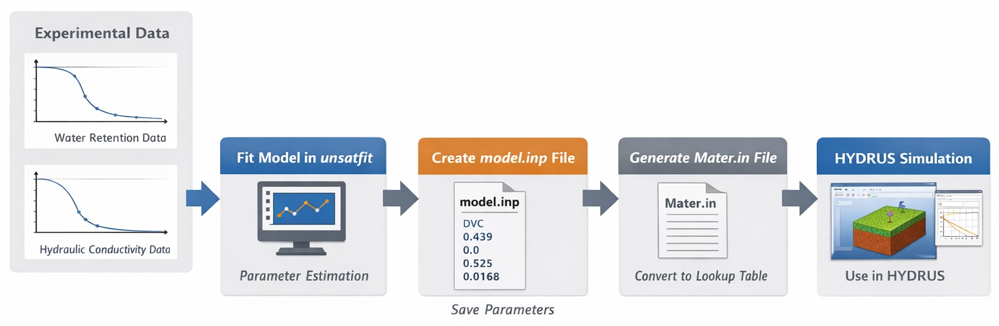
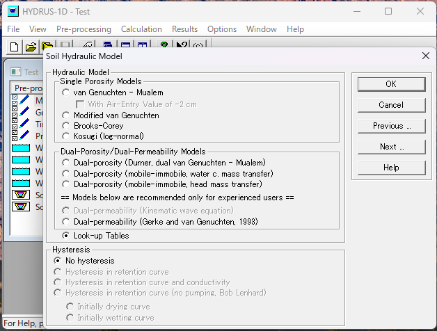

# Using unsatfit with HYDRUS

[HYDRUS](https://www.pc-progress.com/en/Default.aspx?hydrus) is a software package for simulating the movement of water, heat, and dissolved substances in soil and other porous materials. In unsatfit, you can estimate the parameters of a water retention function (WRF) and a hydraulic conductivity function (HCF) from experimental data used in such simulations. However, HYDRUS does not directly support all analytical hydraulic models available in unsatfit. Instead, it can use hydraulic functions supplied through a discrete lookup table stored in `Mater.in`. This limitation can be addressed by converting a fitted unsatfit model into a `Mater.in` file that HYDRUS can read.

The following diagram illustrates this workflow:



As illustrated in the figure, the workflow allows you to:

- fit hydraulic models to experimental data in unsatfit,
- export the fitted model parameters in a reusable format,
- convert them into HYDRUS lookup-table format,
- and use the resulting hydraulic properties directly in HYDRUS simulations.

The overall workflow is as follows:

1. Save the model name and parameter values to a `model.inp` file.
2. Generate a `Mater.in` file from `model.inp` for use in HYDRUS.

First, install **unsatfit version 6.2 or later**, then follow the steps below.

## Creating a `model.inp` file

The `model.inp` file stores the hydraulic model and its parameters. The ".inp" extension is used because this format is compatible with [PEST](pest.md) input files.

The file format is plain text:

- On the **first line**, write the model name as listed in the "Name" field on the [Hydraulic models](model.md) page.
- From the **second line onward**, write the numerical values corresponding to the parameters listed under **Full parameters**, in the specified order.

For example, for the **DVC** model:

```text
DVC
0.439
0.0
0.525
0.0168
0.760
0.165
0.000131
7.36
1.0
0.100
```

This file can be created directly with any text editor.

### When both water retention and hydraulic conductivity data are available

If both water retention and hydraulic conductivity data are available, determine the parameters of the WRF and HCF by following the procedure described in [Sample code for optimizing WRF and HCF](code-hcc.md).

In the provided sample code, after `f.optimize()`, call:

```python
f.save_input()
```

To specify a filename, use:

```python
f.save_input(filename='PATH')
```

To create a template file `model.tpl`, use:

```python
f.save_template()
```

Although the template file is not used if you are not working with PEST, it is still useful because it saves the parameter list.

### When only water retention data are available

If only water retention data are available, determine the WRF parameters by following the procedure described in [Sample code for optimizing water retention curves](code-wrc.md).

In the provided sample code, after `f.optimize()`, call:

```python
f.save_input(hc_param=[0.01, 0.5, 2])
```

where `hc_param` is a list of HCF parameters in the required order.

To specify a filename, use:

```python
f.save_input(filename='PATH')
```

To create a template file `model.tpl`, use:

```python
f.save_template()
```

Although the template file is not used if you are not working with PEST, it is recommended to create it because it preserves the parameter list.

Alternatively, you may determine the WRF parameters using [SWRC Fit](https://seki.webmasters.gr.jp/swrc/) and then create the `model.inp` file manually with a text editor. In that case, write the model name on the first line and the parameter values, including the HCF parameters, one per line in the required order.

## Creating a `Mater.in` file

`Mater.in` is a file that contains discrete data for the WRF and HCF. In HYDRUS, this data can be used to specify the hydraulic functions.

You can generate a `Mater.in` file from `model.inp` by creating and running a Python script such as:

```python
import unsatfit
f = unsatfit.Fit()
f.load_input(filename='model.inp')
f.save_mater(filename='Mater.in')
```

If you want to specify the minimum and maximum pressure head values and the number of points (up to 100) in `Mater.in`, use:

```python
import unsatfit
f = unsatfit.Fit()
f.load_input(filename='model.inp')
f.min_h = 1e-6
f.max_h = 1e6
f.points = 100
f.save_mater(filename='Mater.in')
```

Example of a `Mater.in` file that was produced with [sample data of Gilat loam](sample/gilat): [Mater.in](Mater.in)

You can use [HYDRUS Mater.in Checker](https://sekika.github.io/mater/) to visualize hydraulic properties from the generated `Mater.in` file.

Save `Mater.in` in the HYDRUS project directory, and then specify **Look-up Tables** in **Soil Hydraulic Model** to use this function in the simulation.



## Integration with PEST

By integrating with PEST, more advanced workflows are possible, such as inverse parameter estimation.

In that case, the workflow is:

1. Generate the input file `model.inp` from the PEST control file and the template file `model.tpl`.
2. Generate `Mater.in` from `model.inp` using unsatfit.
3. Run the simulation in HYDRUS.

This enables automated parameter estimation workflows in which PEST iteratively updates parameters and reruns HYDRUS simulations.

Details are explained in [Using unsatfit with PEST](pest.md).