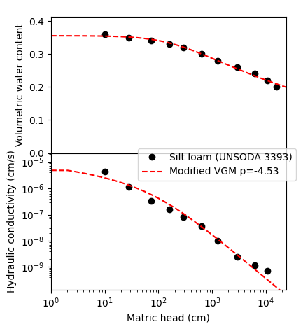

# unsatfit

unsatfit is a Python library for optimizing parameters of functions of soil hydraulic properties (water retention function and unsaturated hydraulic conductivity function). It was developed to write the following paper, and unsatfit determined the parameters of hydraulic properties and drew figures in this paper.

Seki, K., Toride, N., & Th. van Genuchten, M. (2022) [Closed-form hydraulic conductivity equations for multimodal unsaturated soil hydraulic properties.](https://doi.org/10.1002/vzj2.20168) Vadose Zone J. 21; e20168.

It supports various hydraulic models such as

- Brooks and Corey model
- van Genuchten model
- Modified van Genuchten and other models
- Kosugi model
- Fredlund and Xing model (water retention only)
- Many types of bimodal models with CH variation
- Peters model
- Fayer and Simmons model

## History

- 2006-07-28: SWRC Fit 1.0 ([JJSSP](https://js-soilphysics.com/downloads/pdf/105067.pdf) version) was released 
- 2007-02-27: SWRC Fit 1.1 ([HESSD](http://dx.doi.org/10.5194/hessd-4-407-2007) version) was released
- 2018-09-27: SWRC Fit 3.1 (last version of Octave) was [released](https://github.com/sekika/swrcfit/releases/tag/v3.1)
- 2021-08-13: SWRC Fit was recommended at [JJSSP](https://doi.org/10.34467/jssoilphysics.148.0_45)
- 2021-11-24: [Paper](https://doi.org/10.1002/vzj2.20168) written with unsatfit was published
- 2022-01-04: unsatfit 4.0 was relesed with new version of SWRC Fit
- 2022-01-21: [unsatfit 4.3](https://pypi.org/project/unsatfit/#history) was released
