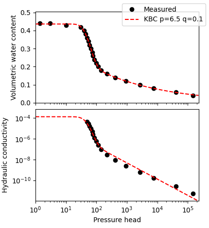

# unsatfit

unsatfit is a Python library for optimizing parameters of functions of soil hydraulic properties (water retention function and hydraulic conductivity function) where equations are explained in the following paper.

* Seki, K., Toride, N., & Th. van Genuchten, M. (2022) [Closed-form hydraulic conductivity equations for multimodal unsaturated soil hydraulic properties.](https://doi.org/10.1002/vzj2.20168) Vadose Zone J. 21; e20168.

The proposed equations are useful for practical applications as shown in the following paper.

* Seki, K., Toride, N., & Th. van Genuchten, M. (2023) [Evaluation of a general model for multimodal unsaturated soil hydraulic properties.](https://doi.org/10.2478/johh-2022-0039) J. Hydrol. Hydromech. 71(1): 22-34.

## User manual

A [user manual](https://arxiv.org/pdf/2302.00472) is available.

See [install](install.md) and [sample code](code.md) for a quick start.

If you encounter any issues, feel free to ask [questions](feedback.md).

## Example output

This is an example output of this program; water retention curve (top) and hydraulic conductivity curve (bottom) of Gilat loam fitted with KBC (KO1BC2-CH) model.

For more examples, see Fig. 6 and Appendix in Seki et al. ([2023](http://www.uh.sav.sk/Portals/16/vcpdf.asp?ID=2081&Article=2023_71_1_Seki_22.pdf)).

## History ([Detailed version](history.md)) {#history}

- 2007-02-27: [SWRC Fit](https://seki.webmasters.gr.jp/swrc/) started to run on the web.
- 2021-08-13: SWRC Fit was recommended at [土壌の物理性](https://doi.org/10.34467/jssoilphysics.148.0_45).
- 2021-11-24: A [paper](https://doi.org/10.1002/vzj2.20168) written with unsatfit was published at VZJ.
- 2022-01-04: Relased unsatfit 4.0, including a new version of SWRC Fit.
- 2023-01-06: Released the [UNSODA viewer](https://sekika.github.io/unsoda/), a web app that displays data from [UNSODA 2.0](https://doi.org/10.15482/USDA.ADC/1173246). For each dataset, water retention data is linked directly to SWRC Fit for model fitting.
- 2023-02-04: A [paper](https://doi.org/10.2478/johh-2022-0039) introducing unsatfit was published in JHH.
- 2024-06-10: Added [Zenodo integration](https://doi.org/10.5281/zenodo.11544880) for permanent archiving.
- 2024-10-20: Received the **JSSP award** ([土壌物理学会賞](https://js-soilphysics.com/prz)) from the Japanese Society of Soil Physics for the [paper of dual-VG fitting](https://doi.org/10.34467/jssoilphysics.155.0_35). A [summary report](https://doi.org/10.34467/jssoilphysics.159.0_103) was subsequently published in Japanese.
- 2024-11-13: Presented a [poster](https://researchmap.jp/sekik/presentations/48434771/attachment_file.pdf) on hysteresis and [hystfit](https://sekika.github.io/hystfit/) at [ASA, CSSA, SSSA meeting](https://researchmap.jp/sekik/presentations/48434771); took a [photo with Rien van Genuchten](https://sekika.github.io/toyo/photos/RVG.html).


[Update of this document](https://github.com/sekika/unsatfit/commits/main/docs)
