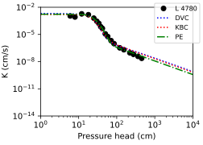

# PEST: Parameter conversion

Building on the basic workflow described in [Using unsatfit with PEST](pest.md), this page describes a technique for stabilizing optimization by reducing the number of free variables. By converting standard hydraulic parameters (e.g., $$q$$ or $$r$$) into the slope parameter $$a$$ of the hydraulic conductivity function (HCF) in the adsorption range, $$a$$ can be fixed to its theoretical value of 1.5 or constrain it within a narrow permitted range.

Seki et al. ([2023](https://doi.org/10.2478/johh-2022-0039)) showed that:

> As shown by Seki et al. (2022), the slope $$a_i$$ of a $$\log h - \log K$$ plot of a multi-BC model in which $$i$$-th subcurve is predominant can be approximated by
>
> $$a_i = (p + r)\lambda_i + qr \quad (9)$$
>
> with $$a_i$$ having a positive value.

The following discussion was included in an earlier draft of the paper but was removed to maintain focus:

> ### Fixing the slope of adsorption HCF
> We may assume that the slope of the HCF curve in the adsorption range, denoted by $$-a$$ in the PE model and by $$a_2$$ in Eq. (9), is 1.5, as theoretically predicted (Peters, 2013; Tokunaga, 2009). For the DBC and KBC models, Eq. (9) gives the relationship between $$q$$ and $$p$$ as
>
> $$q = (a-p\lambda_2)/r+\lambda_2 \quad (10)$$
>
> where $$a_2$$ is written as $$a$$. For the DVC model, from Eq. (9) and replacing $$\lambda_2$$ with the equivalent expression $$n_2-q$$, we obtain $$r$$ as a function of $$p$$:
>
> $$r=(a+pq)/n_2 -p \quad (11)$$
>
> We can substitute Eq. (10) into the HCF of the DBC or KBC, or substitute Eq. (11) into the HCF of the DVC model, to obtain an HCF in which ($$K_s$$, $$p$$, $$a$$) are the model parameters. By setting $$a=1.5$$, only ($$K_s$$, $$p$$) remain as free parameters. The HCF curve optimized using this method has a slope of 1.5 in the adsorption range, consistent with the theoretical prediction. Figure 7 illustrates this method for sample L4780 using DVC and KBC fitting. The curves obtained with fixed $$a$$=1.5 were similar to the PE model with $$a$$=1.5 and optimized $$K_s$$, $$p$$, and $$\omega$$.
>
> 
>
> Fig. 7. Hydraulic conductivity curve for loam soil in UNSODA (ID 4780), fitted using the DVC, KBC and PE models with $$a$$=1.5.

As illustrated in this excerpt, by substituting the variable $$q$$ or $$r$$ with the parameter $$a$$, $$a$$ = 1.5 can be treated as a constant, effectively reducing the number of free parameters in your optimization by one.

The following describes how to apply this parameter conversion technique to optimize the free variables defined in unsatfit using PEST. 

### Modifying the PEST template

If we take the DVC model as an example, we use the relationship $$r = (a+pq)/n_2 - p$$. First, you need to modify your standard DVC `model.tpl` file. 

The original template looks like this:

```text
ptf #
DVC
# qs         #
# qr         #
# w1         #
# a1         #
# m1         #
# m2         #
# Ks         #
# p          #
# q          #
# r          #
```

To implement the conversion, change the model name (e.g., to `DVCA` to indicate the modified version) and replace the parameter $$r$$ with $$a$$:

```text
ptf #
DVCA
# qs         #
# qr         #
# w1         #
# a1         #
# m1         #
# m2         #
# Ks         #
# p          #
# q          #
# a          #
```

In your PEST control file (`.pst`), you will set $$a$$ as a fixed parameter with a value of 1.5. When PEST runs, it will generate an intermediate input file from this template. Let's configure PEST to save this generated file as `model-conv.inp`.

### Python script for parameter conversion

Next, you need a Python script to convert between PEST's output and unsatfit. This script will read `model-conv.inp`, calculate the actual value of $r$, generate a standard `model.inp` file, and then instruct unsatfit to create `Mater.in`.

Save the following script as `mat.py` (replacing the standard one used in the basic workflow):

```python
import unsatfit
print('Converting parameters')

# 1. Read the input file generated by PEST
with open('model-conv.inp', 'r') as f:
    lines = f.readlines()

# Extract parameters based on the DVCA template order (line 2 onward)
qs, qr, w1, a1, m1, m2, Ks, p, q, a = map(float, lines[1:11])

# 2. Calculate r based on the relationship r = (a + pq) / n2 - p
# For the van Genuchten model, m = 1 - 1/n, therefore n = 1 / (1 - m)
n2 = 1 / (1 - m2)
r = (a + p * q) / n2 - p

# 3. Write the standard model.inp file for unsatfit
parameters = [qs, qr, w1, a1, m1, m2, Ks, p, q, r]
with open('model.inp', 'w') as f:
    f.write("DVC\n")
    for param in parameters:
        f.write(f"{param}\n")

# 4. Generate Mater.in using unsatfit
f = unsatfit.Fit()
print('Creating Mater.in')
f.load_input(filename='model.inp')
f.save_mater(filename=r'C:\Users\Public\Documents\PC-Progress\Hydrus-1D 4.xx\Projects\Test\Mater.in')
```

By including this script in your `runmodel.bat` execution sequence, PEST will successfully optimize the model while adhering to the theoretically predicted slope of 1.5 for the adsorption HCF, effectively stabilizing the inverse analysis by reducing the degrees of freedom. Alternatively, it is also possible to set $$a$$ = 1.5 as an initial value and assign it a narrow permitted range (tight upper and lower bounds) in PEST, allowing for minor adjustments during the optimization process.

This parameter conversion approach is not limited to the DVC model; it can also be readily applied to other bimodal or trimodal models. For trimodal models tri-VG and BVV, simply replace $$n_2$$ with $$n_3$$ and use the relation $$r = (a + pq)/n_3 - p$$.
