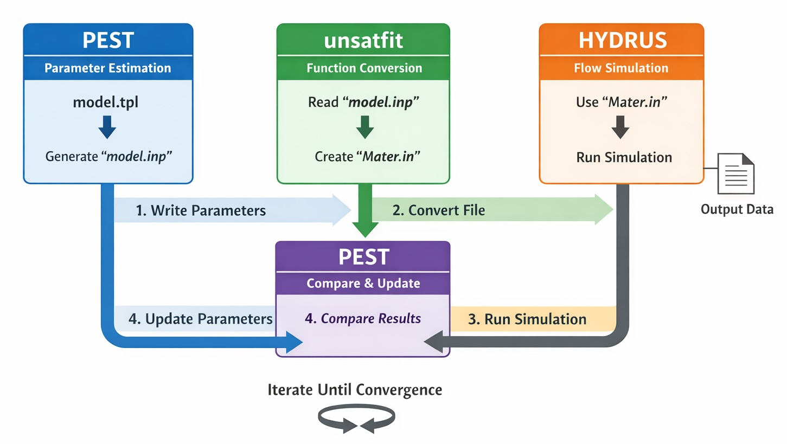
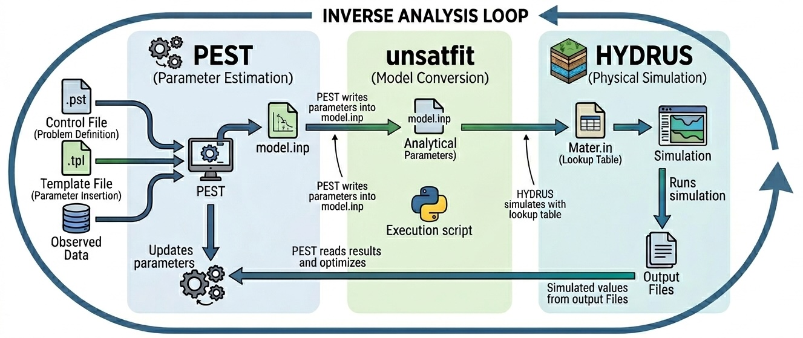

# Using unsatfit with PEST

[PEST](https://pesthomepage.org/) is a software package for parameter estimation and inverse analysis. It adjusts model parameters so that simulation results reproduce observed data as closely as possible. PEST is widely used in hydrology and environmental modeling, including workflows with [HYDRUS](https://www.pc-progress.com/en/Default.aspx?hydrus) (e.g. Urbina et al., [2021](https://doi.org/10.1111/ejss.13103); Liu et al., [2021](https://doi.org/10.1016/j.jhydrol.2020.125823); Kaur et al., [2025](https://doi.org/10.1016/j.agwat.2025.109947)).

When PEST is used together with HYDRUS, it allows estimation of soil hydraulic parameters by repeatedly running HYDRUS simulations and comparing the calculated results with observations. However, when using a hydraulic function that is available in unsatfit but is not supported directly by HYDRUS, an additional step is needed. HYDRUS reads hydraulic properties through `Mater.in` lookup tables, whereas unsatfit handles analytical WRF (water retention function) and HCF (hydraulic conductivity function) models and their parameters.

This is where the integration described in [Using unsatfit with HYDRUS](hydrus.md) becomes important. By combining PEST, unsatfit, and HYDRUS:

- **PEST** updates parameter values during inverse analysis,
- **unsatfit** converts those parameter values into a hydraulic lookup table,
- **HYDRUS** performs the flow simulation based on the lookup table.

In this way, inverse analysis can be performed even when the hydraulic properties are defined by functions available in unsatfit but not directly implemented in HYDRUS. This approach effectively bypasses the limitation that HYDRUS cannot directly use arbitrary analytical hydraulic functions.

The following diagram illustrates the coupling between the three components:



The overall workflow is as follows:

1. PEST writes parameter values into `model.inp` using `model.tpl`.
2. unsatfit reads `model.inp` and generates `Mater.in`.
3. HYDRUS runs a simulation using `Mater.in`.
4. PEST compares simulated results with observed data and updates parameters.
5. The cycle is repeated until convergence.

## Files required by PEST

To perform inverse analysis with PEST, you need the following files:

- a [control file](https://help.pesthomepage.org/index.html?pest-control-file.html) (`.pst`)
- a template file (`.tpl`)
- an instruction file (`.ins`)

Among these files, the parts related to the WRF and HCF are the **parameter group** and **parameter data** sections of the control file. In these sections, you specify:

- initial parameter values,
- whether each parameter is fixed or adjustable,
- upper and lower bounds,
- and additional parameter settings (e.g., transformation and scaling)

In the **model input/output** section, specify that PEST should generate `model.inp` from `model.tpl`, for example:

```text
* model input/output
model.tpl model.inp
```

With this setting, PEST creates `model.inp` from `model.tpl` by inserting the current parameter values.

## Role of each file in this workflow

### `model.tpl`

`model.tpl` is the PEST template file corresponding to `model.inp`. It defines where parameter values should be inserted.

### `model.inp`

`model.inp` is the input file read by unsatfit. It contains:

- the model name on the first line,
- the parameter values on the following lines.

In a PEST workflow, this file is generated automatically by PEST from `model.tpl`.

### `Mater.in`

`Mater.in` is the lookup-table file used by HYDRUS. It is generated from `model.inp` by unsatfit.

### HYDRUS output

HYDRUS generates output files (e.g., Nod_Inf.out, Obs_Node.out) that contain simulated variables such as pressure head or water content.

These files are not used directly by PEST but are read through the instruction file (`.ins`), which extracts the values corresponding to observations.

### `.ins` file

The instruction file tells PEST how to read simulation results and extract observation values from HYDRUS output files (e.g., Nod_Inf.out, Obs_Node.out). In other words, the instruction file links HYDRUS output to PEST observations.

### `.pst` file

The control file defines the entire inverse analysis problem, including parameters, observations, files, and the model command line.

## Overall workflow for inverse analysis

The full procedure is as follows.

### 1. Prepare a HYDRUS project

First, prepare a HYDRUS project that runs correctly with a `Mater.in` file placed in the project directory.

In HYDRUS, specify **Look-up Tables** in **Soil Hydraulic Model** so that the hydraulic functions are read from `Mater.in`.

Also decide which HYDRUS output file will be used for comparison with observations, because this file will later be read by the PEST instruction file.

### 2. Prepare a hydraulic model for unsatfit-HYDRUS coupling

Prepare the files needed for the unsatfit-to-HYDRUS conversion as described in [Using unsatfit with HYDRUS](hydrus.md).

In particular, prepare:

- `model.tpl`, which will be used by PEST,
- and the corresponding `model.inp` structure for the selected hydraulic model.

If needed, these files can be created either manually or from fitted results in unsatfit, as explained in [Using unsatfit with HYDRUS](hydrus.md).

### 3. Edit the PEST control file

Create a PEST control file (`.pst`) and define the inverse problem.

In particular:

- define parameter groups in the **parameter group** section,
- define each parameter in the **parameter data** section,
- define observations,
- define the command line used to run the model (explained later),
- and define file relationships in the **model input/output** section.

For the unsatfit-HYDRUS workflow, the important setting is:

```text
* model input/output
model.tpl model.inp
```

This tells PEST to generate `model.inp` from `model.tpl`.

In the **parameter data** section, the parameters should correspond to the WRF and HCF parameters in the order expected by the hydraulic model.

### 4. Prepare the instruction file

Create an instruction file (`.ins`) so that PEST can extract simulated values from the HYDRUS output file.

The exact content depends on which HYDRUS output file is used and which values are compared with observations.

### 5. Prepare the model execution script

The conversion from `model.inp` to `Mater.in` is explained in [Using unsatfit with HYDRUS](hydrus.md). For a PEST workflow, prepare the following:

- A Python script, `mat.py`, that generates `Mater.in` from `model.inp`, for example (update the path to match your environment)

```python
import unsatfit
f = unsatfit.Fit()
print('Running mat.py')
f.load_input(filename='model.inp')
f.save_mater(filename=r'C:\Users\Public\Documents\PC-Progress\Hydrus-1D 4.xx\Projects\Test\Mater.in')
```

- A batch file, `runmodel.bat`, that runs the Python script and then starts HYDRUS, for example:

```bat
python mat.py
"C:\Program Files (x86)\PC-Progress\Hydrus-1D 4.xx\H1D_CALC.exe" "C:\Users\Public\Documents\PC-Progress\Hydrus-1D 4.xx\Projects\Test"
```

- Write in the PEST control file to run the batch file:

```text
* model command line
.\runmodel.bat
```

The execution sequence is then:

1. PEST generates `model.inp` from `model.tpl`,
2. PEST runs `runmodel.bat`,
3. `runmodel.bat` runs `mat.py`,
4. `mat.py` generates `Mater.in` from `model.inp`,
5. `runmodel.bat` runs HYDRUS,
6. HYDRUS writes output files,
7. PEST reads the results.

Note that PEST does not directly run HYDRUS; it only executes the command specified in the control file, which orchestrates the entire workflow.

### 6. Run PEST

Once the `.pst`, `.tpl`, `.ins`, HYDRUS project, and execution script are ready, run PEST.

During inverse analysis, PEST repeats the following cycle:

1. write parameter values into `model.inp` from `model.tpl`,
2. execute the model command,
3. unsatfit converts `model.inp` to `Mater.in`,
4. HYDRUS runs using `Mater.in`,
5. PEST reads simulated results using the instruction file,
6. PEST compares simulated and observed values,
7. PEST updates parameter values.

This cycle continues until the optimization stops according to the PEST settings.

## Summary of the coupled workflow



By combining PEST, unsatfit, and HYDRUS, inverse analysis can be carried out with hydraulic functions that are available in unsatfit but not directly implemented in HYDRUS:

- PEST manages parameter estimation,
- unsatfit converts parameter sets into `Mater.in`,
- HYDRUS performs the physical simulation.

The key connection points are:

- `model.tpl` -> `model.inp` by PEST
- `model.inp` -> `Mater.in` by unsatfit
- `Mater.in` -> HYDRUS simulation
- HYDRUS output -> PEST through an instruction file

For details of PEST syntax and settings, refer to the [official website](https://pesthomepage.org/).

## Technical note: parameter conversion

As theoretically predicted, the slope of the HCF curve at the adsorption water range can often be assumed to be approximately 1.5. By applying a mathematical relationship to substitute a standard model variable (such as $$q$$ or $$r$$) with this slope parameter $$a$$, you can treat $$a$$ = 1.5 as a constant, effectively reducing the number of free parameters in your PEST optimization by one.

For a detailed explanation of this theory and a step-by-step guide on how to implement this parameter conversion in your Python script and PEST template files, please refer to [PEST: Parameter conversion](pest-conversion.md).

## Technical note: estimation from multiple initial values

As discussed in Seki et al. ([2023](https://doi.org/10.2478/johh-2022-0039)), when the WRF parameters are determined first and the HCF parameters (Ks, p, r) or (Ks, p, q) are estimated afterward, it is effective to try multiple initial values for (p, r) or (p, q).

For example, you may use:

- p = (1, 2, 4, 6)
- r = (0.5, 1, 2)

which gives a total of 12 initial combinations for (p, r).
